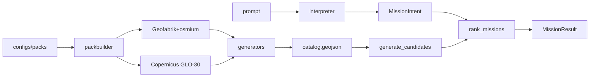

# Architecture

## Non-negotiables

1. Deterministic GIS discovers candidates at **pack build** time (named generators).
2. Interpreters (rules or Ollama) emit **`MissionIntent` only** — never rankings or coordinates invented as winners.
3. Mission run = **filter + featurize + preference-vector score** over `layers/catalog.geojson`.
4. Synthetic fixtures are CI-only; production packs declare OSM/DEM provenance in `NOTICE`.

## Packages

| Package | Role |
|---------|------|
| `adventure-core` | Schemas, intent, catalog types, config loaders |
| `adventure-packbuilder` | OSM/DEM ingest + discovery pipeline |
| `adventure-gis` | Load catalog, compute features ([GIS features](gis-features.md)) |
| `adventure-scoring` | Preference alignment, gates, [confidence](confidence.md) |
| `adventure-inference` | Rules / Ollama router ([offline inference](offline-inference.md)) |
| `adventure-cli` | `adventurectl` |

## Catalog contract

Canonical file: `layers/catalog.geojson` (schema `0.3.0`). Each feature carries `generator`, `provenance`, `evidence`, and `densify` hooks for future Phase C densification without changing `MissionIntent`.
