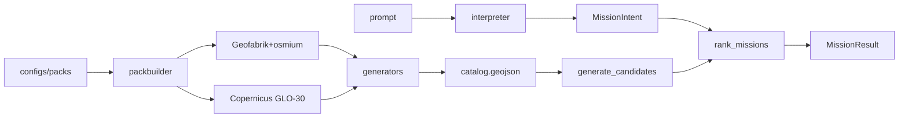

# Architecture

## Non-negotiables

1. Deterministic GIS discovers candidates at **pack build** time (named generators).
2. Interpreters (rules or Ollama) emit **`MissionIntent` only** — never rankings or coordinates invented as winners.
3. Mission run = **filter + featurize + preference-vector score** over `layers/catalog.geojson`.
4. Synthetic fixtures are CI-only; production packs declare OSM/DEM provenance in `NOTICE`.
5. Built packs under `data/packs/` are **local artifacts** — never committed (see [RFC-0003](https://github.com/OmarFarooq908/TerraQuest/blob/main/RFC/0003-region-pack-architecture.md)).

## Packages

| Package | Role |
|---------|------|
| `adventure-core` | Schemas, intent, catalog types, config loaders |
| `adventure-packbuilder` | OSM/DEM ingest + discovery pipeline |
| `adventure-gis` | Load catalog, compute features ([GIS features](gis-features.md)) |
| `adventure-scoring` | Preference alignment, gates, [confidence](confidence.md) |
| `adventure-inference` | Rules / Ollama router ([offline inference](offline-inference.md)) |
| `adventure-cli` | `adventurectl` |

## Region Pack contract

Frozen in **RFC-0003**. Short form:

| Kind | Location | Commit? |
|------|----------|---------|
| Production pack | `data/packs/<id>/` | **No** |
| Synthetic fixture | `fixtures/<id>/` | Yes (CI) |

Production tree: `pack.yaml`, `NOTICE`, `build_stats.json`, `layers/*.geojson`
(catalog + support layers). Pack `content_hash` (v2) = domain-separated SHA-256
of all layer GeoJSON bytes + discovery knobs (`selected_by_generator`, quotas,
spacing, grid, schema version, generators run), truncated to 16 hex.
`build_stats.json` also records per-layer digests for audit.

Versioning: refresh data → same `pack_id`, new hash; breaking catalog fields →
bump `feature_schema_version`; intentional identity break → new `pack_id`.

Details: [pack builder](pack-builder.md), [RFC-0003](https://github.com/OmarFarooq908/TerraQuest/blob/main/RFC/0003-region-pack-architecture.md),
[RFC-0004](https://github.com/OmarFarooq908/TerraQuest/blob/main/RFC/0004-duckdb-pack-query.md) (optional derived DuckDB).

## Catalog contract

Canonical file: `layers/catalog.geojson` (schema `0.3.0`). Each feature carries
`generator`, `provenance`, `evidence`, and `densify` hooks for future Phase C
densification without changing `MissionIntent`. Mission runtime does **not**
densify today.
